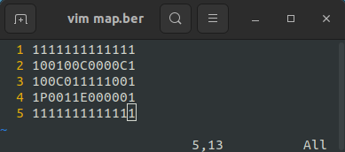

# so_long

## Description

The `so_long` project is a graphical game that challenges the player to navigate a map, collect items, and reach an exit without getting trapped. It is implemented using the macOS-specific MLX library, which handles the graphical interface. The game uses a top-down view with a tile-based system where the player moves around a map while collecting items and avoiding obstacles.

## Features

- Graphical interface using the `MiniLibX` (MLX) library.
- Dynamic map loading from `.ber` files.
- Player can move around, collect items, and reach an exit.
- Map validation ensures correct formatting, wall boundaries, and a valid path from the player to the exit.
- Keyboard inputs for movement (`WASD` or arrow keys) and exit.
- Supports flood-fill algorithm for path validation.
- Custom sprites for player, walls, collectible items, and the exit.

## Compilation and Usage

### Compilation

To compile the project on macOS, run the following command in the root directory:
```bash
make
```

This will generate the `so_long` executable.

### Usage

To run the game, provide a map file in `.ber` format as an argument:

```bash
./so_long [path_to_map.ber]
```

### Example usage:
```bash
./so_long test_maps/map.ber
```


## Map Format

The map must be provided as a `.ber` file and follow these rules:

- Must be rectangular.
- Must be surrounded by walls (`1` characters).
- Must contain at least one player (`P`), one collectible (`C`), and one exit (`E`).

### Example map (`map.ber`):
```
111111
1P00C1
1E0011
111111
```

- `1`: Wall
- `P`: Player start position
- `C`: Collectible item
- `E`: Exit
- `0`: Empty space (walkable area)



## Project Structure

```css
.
├── Makefile
├── main.c
├── so_long.h
├── gnl/
│   ├── gnl.c
│   ├── gnl.h
│   └── gnl_utils.c
├── map/
│   ├── check_format.c
│   ├── check_map.c
│   ├── close_map.c
│   ├── display_map.c
│   ├── flood_fill.c
│   ├── get_map.c
│   ├── move_player.c
│   └── update_map.c
├── minilib/
│   ├── ft_itoa.c
│   ├── ft_putchar_fd.c
│   ├── ft_putstr_fd.c
│   ├── ft_split.c
│   ├── ft_strchr.c
│   ├── ft_strcmp.c
│   ├── ft_strdup.c
│   ├── ft_strjoin.c
│   ├── ft_strlen.c
│   ├── ft_strrchr.c
│   ├── ft_substr.c
│   └── minilib.h
├── mlx/
│   ├── Makefile
│   ├── mlx.h
│   ├── mlx_init_loop.m
│   └── (other MLX-related files)
├── spt/
│   ├── chest.xpm
│   ├── coin.xpm
│   ├── grass.xpm
│   ├── menu.xpm
│   ├── player.xpm
│   └── wall.xpm
├── test_maps/
│   ├── avmap.ber
│   ├── avmap.ber
│   ├── big_map.ber
│   └── map.ber
└── utils/
    ├── ft_arr_height.c
    ├── ft_error.c
    ├── ft_init.c
    ├── ft_mem.c
    └── ft_success.c
```

- `gnl/`: Implementation of the `get_next_line` function for reading the map file.
- `map/`: Functions responsible for checking the map format, displaying the map, handling player movement, and validating the map using a `flood-fill algorithm`.
- `minilib/`: Custom utility functions (e.g., string manipulation, memory management).
- `mlx/`: `MiniLibX` files specific to macOS for handling the graphical interface.
- `spt/`: `XPM` sprite files used for the game’s graphical elements.
- `test_maps/`: Example `.ber` map files for testing.

## How to Play

- Move the player using the arrow keys or `W`, `A`, `S`, `D`.
- Collect all collectibles (`C`) and head to the exit (`E`) to win.
- The game can be closed by pressing the `ESC` key or clicking the window's `close` button.

## Author

Project developed by [Emin A.](https://github.com/emayia) as part of the École 42 curriculum.